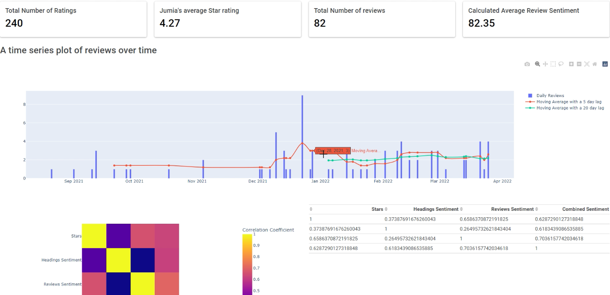

# Jumia Reviews Sentiment Analyser

This webapp extracts reviews from a Jumia product page and calculates sentiment for each and every review and correlates that to the stars given.
This app uses:-
- Requests and BeautifulSoup4 to scrape and parse the page
- HuggingFace's Distilbert for Sentiment Analysis
- Dash, Plotly, Flask and Bootstrap to the webapp

## How it works
Click the photo to play a video recording

[](video.mp4)

## Prerequisites
Tensorflow/ Pytorch
Python

## Installation

Have Python installed locally.
Change directory to the projects's folder

```bash
pip install -r requirements.txt
```

## Usage
Run the `app.py` file by

```bash
python app.py
```

Logon to `127.0.0.1:8050` to use the app

## Contributing
Pull requests are welcome. For major changes, please open an issue first to discuss what you would like to change.

Please make sure to update tests as appropriate.

## License
[MIT](https://choosealicense.com/licenses/mit/)